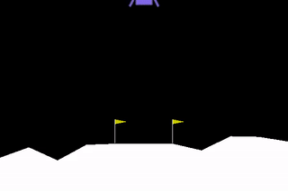
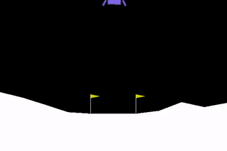

NEATEST: Evolving Neural Networks Through Augmenting Topologies with Evolution Strategy Training
===============================================================================================

It is NEAT but the weights are trained with Natural Evolution Strategy and
the weights are shared across genomes.

  

# Requirements
```
numpy
cloudpickle
```

# Install
```
pip install nesneat
```

## Optional
```
matplotlib # To draw networks
mpi4py # For parallelization
gym # For examples
```

# Usage
Check [examples](https://github.com/goktug97/NEATEST/tree/master/examples)
```
PYTHONPATH="$(pwd):$PYTHONPATH" python examples/cartpole.py
# Or in parallel
PYTHONPATH="$(pwd):$PYTHONPATH" mpirun -np 2 python examples/cartpole.py
```
